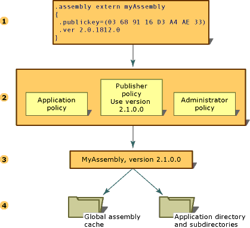

# Assembly Versioning
All versioning of assemblies that use the common language runtime is done at the assembly level. The specific version of an assembly and the versions of dependent assemblies are recorded in the assembly's manifest. The default version policy for the runtime is that applications run only with the versions they were built and tested with, unless overridden by explicit version policy in configuration files (the application configuration file, the publisher policy file, and the computer's administrator configuration file).  
  
> [!NOTE]
>  Versioning is done only on assemblies with strong names.  
  
 The runtime performs several steps to resolve an assembly binding request:  
  
1. Checks the original assembly reference to determine the version of the assembly to be bound.  
  
2. Checks for all applicable configuration files to apply version policy.  
  
3. Determines the correct assembly from the original assembly reference and any redirection specified in the configuration files, and determines the version that should be bound to the calling assembly.  
  
4. Checks the global assembly cache, codebases specified in configuration files, and then checks the application's directory and subdirectories using the probing rules explained in [How the Runtime Locates Assemblies](../../framework/deployment/how-the-runtime-locates-assemblies.md).  
  
 The following illustration shows these steps:  
  
 
  
 For more information about configuring applications, see [Configuring Apps](../../../docs/framework/configure-apps/index.md). For more information about binding policy, see [How the Runtime Locates Assemblies](../../framework/deployment/how-the-runtime-locates-assemblies.md).  
  
## Version Information  
 Each assembly has two distinct ways of expressing version information:  
  
- The assembly's version number, which, together with the assembly name and culture information, is part of the assembly's identity. This number is used by the runtime to enforce version policy and plays a key part in the type resolution process at run time.  
  
- An informational version, which is a string that represents additional version information included for informational purposes only.  
  
### Assembly Version Number  
 Each assembly has a version number as part of its identity. As such, two assemblies that differ by version number are considered by the runtime to be completely different assemblies. This version number is physically represented as a four-part string with the following format:  
  
 \<*major version*>.\<*minor version*>.\<*build number*>.\<*revision*>  
  
 For example, version 1.5.1254.0 indicates 1 as the major version, 5 as the minor version, 1254 as the build number, and 0 as the revision number.  
  
 The version number is stored in the assembly manifest along with other identity information, including the assembly name and public key, as well as information on relationships and identities of other assemblies connected with the application.  
  
 When an assembly is built, the development tool records dependency information for each assembly that is referenced in the assembly manifest. The runtime uses these version numbers, in conjunction with configuration information set by an administrator, an application, or a publisher, to load the proper version of a referenced assembly.  
  
 The runtime distinguishes between regular and strong-named assemblies for the purposes of versioning. Version checking only occurs with strong-named assemblies.  
  
 For information about specifying version binding policies, see [Configuring Apps](../../../docs/framework/configure-apps/index.md). For information about how the runtime uses version information to find a particular assembly, see [How the Runtime Locates Assemblies](../../framework/deployment/how-the-runtime-locates-assemblies.md).  
  
### Assembly Informational Version  
 The informational version is a string that attaches additional version information to an assembly for informational purposes only; this information is not used at run time. The text-based informational version corresponds to the product's marketing literature, packaging, or product name and is not used by the runtime. For example, an informational version could be "Common Language Runtime version 1.0" or "NET Control SP 2". On the Version tab of the file properties dialog in Microsoft Windows, this information appears in the item "Product Version".  
  
> [!NOTE]
>  Although you can specify any text, a warning message appears on compilation if the string is not in the format used by the assembly version number, or if it is in that format but contains wildcards. This warning is harmless.  
  
 The informational version is represented using the custom attribute <xref:System.Reflection.AssemblyInformationalVersionAttribute?displayProperty=nameWithType>. For more information about the informational version attribute, see [Setting Assembly Attributes](set-attributes.md).  
  
## See also

- [How the Runtime Locates Assemblies](../../framework/deployment/how-the-runtime-locates-assemblies.md)
- [Configuring Apps](../../../docs/framework/configure-apps/index.md)
- [Setting Assembly Attributes](set-attributes.md)
- [Assemblies in .NET](index.md)
