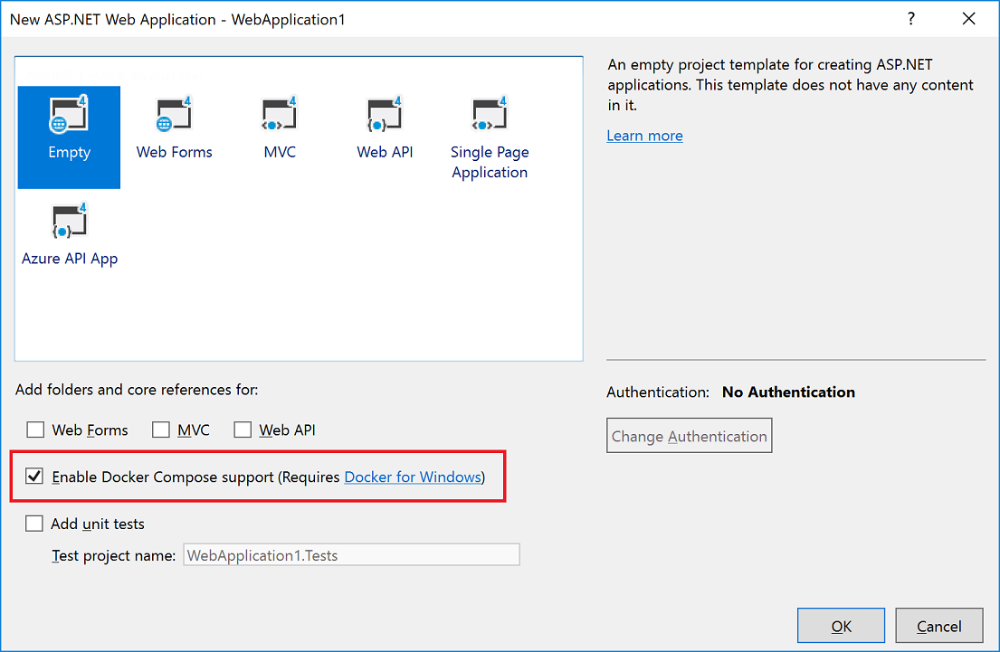

# Using Visual Studio Tools for Docker (Visual Studio on Windows)

The Visual Studio Tools for Docker developer workflow is similar to using Visual Studio Code and Docker CLI (it is based on the same Docker CLI). Visual Studio Tools for Docker makes it even easier to get started, simplifies the process, and provides greater productivity for the build, run, and compose tasks. Execute and debug your containers via simple actions like **F5** and **Ctrl**+**F5**.

> [!NOTE]
> This article applies to Visual Studio on Windows, and not Visual Studio for Mac.

## Configure your local environment

With the latest versions of Docker for Windows ([https://docs.docker.com/docker-for-windows/](https://docs.docker.com/docker-for-windows/)), the straightforward setup makes it easy to develop Docker applications.

Docker support is included in Visual Studio 2017. Download Visual Studio 2017 here: [https://aka.ms/vsdownload?utm_source=mscom&utm_campaign=msdocs](https://aka.ms/vsdownload?utm_source=mscom&utm_campaign=msdocs)

## Use Docker Tools in Visual Studio 2017

There are two levels of Docker support you can add to a project. In .NET Core web app projects, you can just add a *Dockerfile* file to the project by enabling Docker support. The next level is container orchestrator support, which adds a *Dockerfile* to the project (if it doesn't already exist) and a *docker-compose.yml* file at the solution level.

The **Add** > **Docker Support** and **Add** > **Container Orchestrator Support** commands are located on the right-click menu (or context menu) of the project node for a web app project in **Solution Explorer**:

### Add Docker support

You can add Docker support to an existing .NET Core web app project by selecting **Add** > **Docker Support** in **Solution Explorer**. You can also enable Docker support during project creation by selecting **Enable Docker Support** in the **New ASP.NET Core Web Application** dialog box that opens after you click **OK** in the **New Project** dialog box.

When you add or enable Docker support, Visual Studio adds a *Dockerfile* file to the project.

> [!NOTE]
> When you enable Docker Compose support during project creation for a .NET Framework web app project (not a .NET Core web app project), container orchestrator support is also added.
>
> 

### Add container orchestrator support

When you want to compose a multicontainer solution, add container orchestrator support to your projects. When you add container orchestrator support, Visual Studio adds a *Dockerfile* to the project (if it doesn't already exist) and a global *docker-compose.yml* file at the solution level. This lets you run and debug a group of containers (a whole solution) at the same time if they're defined in the same *docker-compose.yml* file. If *docker-compose.yml* already exists, Visual Studio just adds the required lines of configuration code to it.

After you add container orchestration support to your project, you see the following new project and files in **Solution Explorer**:

**More info:** For further details on the services implementation and use of Visual Studio Tools for Docker, read the following articles:

Build, debug, update, and refresh apps in a local Docker container: [https://docs.microsoft.com/azure/vs-azure-tools-docker-edit-and-refresh/](https://docs.microsoft.com/azure/vs-azure-tools-docker-edit-and-refresh)

Deploy an ASP.NET Core Docker container to a container registry: [https://docs.microsoft.com/azure/vs-azure-tools-docker-hosting-web-apps-in-docker/](https://docs.microsoft.com/azure/vs-azure-tools-docker-hosting-web-apps-in-docker)

>[!div class="step-by-step"]
[Previous](docker-apps-inner-loop-workflow.md)
[Next](set-up-windows-containers-with-powershell.md)