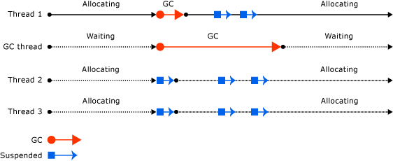

# Background garbage collection

In background garbage collection (GC), ephemeral generations (0 and 1) are collected as needed while the collection of generation 2 is in progress. Background garbage collection is performed on one or more dedicated threads, depending on whether it's background or server GC, and applies only to generation 2 collections.

Background garbage collection is enabled by default. It can be enabled or disabled with the [gcConcurrent](../../../docs/framework/configure-apps/file-schema/runtime/gcconcurrent-element.md) configuration setting in .NET Framework apps or the [System.GC.Concurrent](../../core/run-time-config/garbage-collector.md#systemgcconcurrentcomplus_gcconcurrent) setting in .NET Core apps.

> [!NOTE]
> Background garbage collection replaces [concurrent garbage collection](#concurrent-garbage-collection) and is available in .NET Framework 4 and later versions. In .NET Framework 4, it's supported only for *workstation* garbage collection. Starting with .NET Framework 4.5, background garbage collection is available for both *workstation* and *server* garbage collection.

A collection on ephemeral generations during background garbage collection is known as *foreground* garbage collection. When foreground garbage collections occur, all managed threads are suspended.

When background garbage collection is in progress and you've allocated enough objects in generation 0, the CLR performs a generation 0 or generation 1 foreground garbage collection. The dedicated background garbage collection thread checks at frequent safe points to determine whether there is a request for foreground garbage collection. If there is, the background collection suspends itself so that foreground garbage collection can occur. After the foreground garbage collection is completed, the dedicated background garbage collection threads and user threads resume.

Background garbage collection removes allocation restrictions imposed by concurrent garbage collection, because ephemeral garbage collections can occur during background garbage collection. Background garbage collection can remove dead objects in ephemeral generations. It can also expand the heap if needed during a generation 1 garbage collection.

## Background workstation vs. server GC

Starting with .NET Framework 4.5, background garbage collection is available for server GC. Background GC is the default mode for server garbage collection.

Background server garbage collection functions similarly to background workstation garbage collection, but there are a few differences:

- Background workstation garbage collection uses one dedicated background garbage collection thread, whereas background server garbage collection uses multiple threads. Typically, there's a dedicated thread for each logical processor.

- Unlike the workstation background garbage collection thread, the background server GC threads do not time out.

The following illustration shows background *workstation* garbage collection performed on a separate, dedicated thread:

The following illustration shows background *server* garbage collection performed on separate, dedicated threads:

## Concurrent garbage collection

> [!TIP]
> This section applies to:
>
> - .NET Framework 3.5 and earlier for workstation garbage collection
> - .NET Framework 4 and earlier for server garbage collection
>
> Concurrent garbage is replaced by [background garbage collection](#background-workstation-garbage-collection) in later versions.

In workstation or server garbage collection, you can [enable concurrent garbage collection](../../../docs/framework/configure-apps/file-schema/runtime/gcconcurrent-element.md), which enables threads to run concurrently with a dedicated thread that performs the garbage collection for most of the duration of the collection. This option affects only garbage collections in generation 2; generations 0 and 1 are always non-concurrent because they finish fast.

Concurrent garbage collection enables interactive applications to be more responsive by minimizing pauses for a collection. Managed threads can continue to run most of the time while the concurrent garbage collection thread is running. This results in shorter pauses while a garbage collection is occurring.

Concurrent garbage collection is performed on a dedicated thread. By default, the CLR runs workstation garbage collection with concurrent garbage collection enabled on both single-processor and multi-processor computers.

The following illustration shows concurrent garbage collection performed on a separate dedicated thread.

## See also

- [Workstation and server garbage collection](workstation-server-gc.md)
- [Run-time configuration options for garbage collection](../../core/run-time-config/garbage-collector.md)
