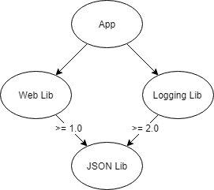
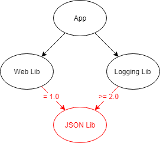
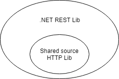
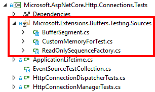

# Dependencies

The primary way of adding dependencies to a .NET library is referencing NuGet packages. NuGet package references allow you to quickly reuse and leverage already written functionality, but they're a common source of friction for .NET developers. Correctly managing dependencies is important to prevent changes in other .NET libraries from breaking your .NET library, and vice versa!

## Diamond dependencies

It's a common situation for a .NET project to have multiple versions of a package in its dependency tree. For example, an app depends on two NuGet packages, each of which depends on different versions of the same package. A diamond dependency now exists in the app's dependency graph.



At build time, NuGet analyzes all the packages that a project depends on, including the dependencies of dependencies. When multiple versions of a package are detected, rules are evaluated to pick one. Unifying packages is necessary because running side-by-side versions of an assembly in the same application is problematic in .NET.

Most diamond dependencies are easily resolved; however, they can create issues in certain circumstances:

1. **Conflicting NuGet package references** prevent a version from being resolved during package restore.
2. **Breaking changes between the versions** cause bugs and exceptions at runtime.
3. **The package assembly is strong named**, the assembly version changed, and the app is running on the .NET Framework. Assembly binding redirects are required.

It's not possible to know what packages will be used alongside your own. A good way to reduce the likelihood of a diamond dependency breaking your library is to minimize the number of packages you depend on.

✔️ DO review your .NET library for unnecessary dependencies.

## NuGet dependency version ranges

A package reference specifies the range of valid packages it allows. Typically, the package reference version in the project file is the minimum version and there's no maximum.

```xml
<!-- Accepts any version 1.0 and above. -->
<PackageReference Include="ExamplePackage" Version="1.0" />
```

The rules that NuGet uses when resolving dependencies are [complex](/nuget/consume-packages/dependency-resolution), but NuGet [by default](/nuget/consume-packages/install-use-packages-visual-studio#install-and-update-options) looks for the lowest applicable version. NuGet prefers the lowest applicable version over using the highest available because the lowest will have the least compatibility issues.

Because of NuGet's lowest applicable version rule, it isn't necessary to place an upper version or exact range on package references to avoid getting the latest version. NuGet already tries to find the lowest, most compatible version for you.

```xml
<!-- Accepts 1.0 up to 1.x, but not 2.0 and higher. -->
<PackageReference Include="ExamplePackage" Version="[1.0,2.0)" />

<!-- Accepts exactly 1.0. -->
<PackageReference Include="ExamplePackage" Version="[1.0]" />
```

Upper version limits will cause NuGet to fail if there's a conflict. For example, one library accepts exactly 1.0 while another library requires 2.0 or above. While breaking changes may have been introduced in version 2.0, a strict or upper limit version dependency guarantees an error.



❌ DO NOT have NuGet package references with no minimum version.

❌ AVOID NuGet package references that demand an exact version.

❌ AVOID NuGet package references with a version upper limit.

## NuGet shared source packages

One way to reduce external NuGet package dependencies is to reference shared source packages. A shared source package contains [source code files](/nuget/reference/nuspec#including-content-files) that are included in a project when referenced. Because you're just including source code files that are compiled with the rest of your project, there's no external dependency and chance of conflict.

Shared source packages are great for including small pieces of functionality. For example, a shared source package of helper methods for making HTTP calls.



```xml
<PackageReference Include="Microsoft.Extensions.Buffers.Testing.Sources" PrivateAssets="All" Version="1.0" />
```



Shared source packages have some limitations. They can only be referenced by `PackageReference`, so older `packages.config` projects are excluded. Also shared source packages are only usable by projects with the same language type. Because of these limitations shared source packages are best used to share functionality within an open-source project.

✔️ CONSIDER referencing shared source packages for small, internal pieces of functionality.

✔️ CONSIDER making your package a shared source package if it provides small, internal pieces of functionality.

✔️ DO reference shared source packages with `PrivateAssets="All"`.

> This setting tells NuGet the package is only to be used at development time and shouldn't be exposed as a public dependency.

❌ DO NOT have shared source package types in your public API.

> Shared source types are compiled into the referencing assembly and can't be exchanged across assembly boundaries. For example, a shared-source `IRepository` type in one project is a separate type from the same shared-source `IRepository` in another project. Types in shared source packages should have an `internal` visibility.

❌ DO NOT publish shared source packages to NuGet.org.

> Shared source packages contain source code and can only be used by projects with the same language type. For example, a C# shared source package cannot be used by an F# application.
>
> Publish shared source packages to a [local feed or MyGet](./publish-nuget-package.md) to consume them internally within your project.

>[!div class="step-by-step"]
>[Previous](nuget.md)
>[Next](sourcelink.md)
