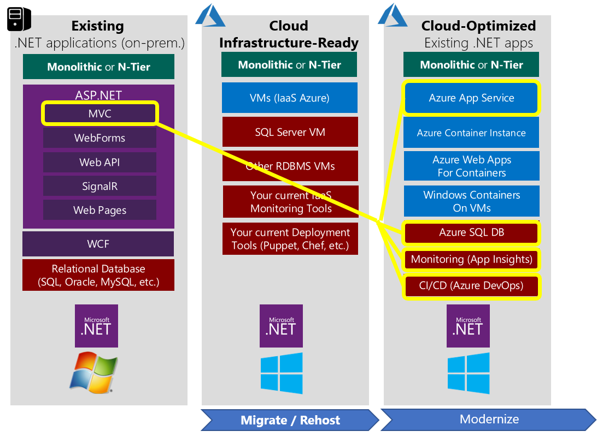
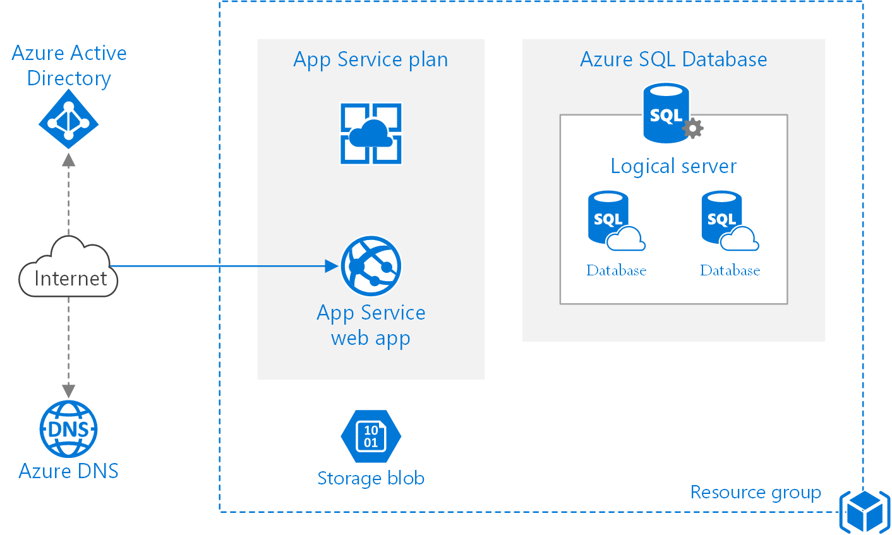
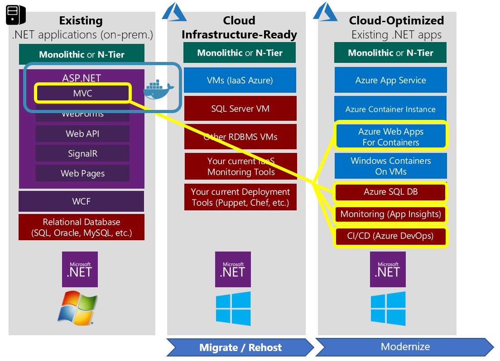
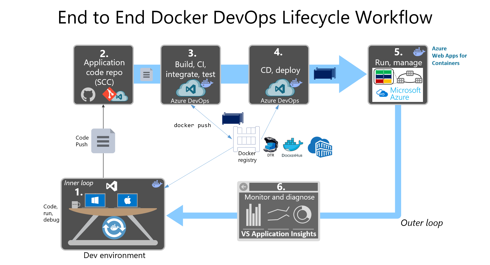

# Azure hosting recommendations for ASP.NET Core web apps

> "Line-of-business leaders everywhere are bypassing IT departments to get applications from the cloud (aka SaaS) and paying for them like they would a magazine subscription. And when the service is no longer required, they can cancel the subscription with no equipment left unused in the corner."  
> _\- Daryl Plummer, Gartner analyst_

Whatever your application's needs and architecture, Microsoft Azure can support it. Your hosting needs can be as simple as a static website or a sophisticated application made up of dozens of services. For ASP.NET Core monolithic web applications and supporting services, there are several well-known configurations that are recommended. The recommendations on this article are grouped based on the kind of resource to be hosted, whether full applications, individual processes, or data.

## Web applications

Web applications can be hosted with:

- App Service Web Apps

- Containers (several options)

- Virtual Machines (VMs)

Of these, App Service Web Apps is the recommended approach for most scenarios, including simple container-based apps. For microservice architectures, consider a container-based approach. If you need more control over the machines running your application, consider Azure Virtual Machines.

### App Service Web Apps

App Service Web Apps offers a fully managed platform optimized for hosting web applications. It's a platform as a service (PaaS) offering that lets you focus on your business logic, while Azure takes care of the infrastructure needed to run and scale the app. Some key features of App Service Web Apps:

- DevOps optimization (continuous integration and delivery, multiple environments, A/B testing, scripting support).

- Global scale and high availability.

- Connections to SaaS platforms and your on-premises data.

- Security and compliance.

- Visual Studio integration.

Azure App Service is the best choice for most web apps. Deployment and management are integrated into the platform, sites can scale quickly to handle high traffic loads, and the built-in load balancing and traffic manager provide high availability. You can move existing sites to Azure App Service easily with an online migration tool, use an open-source app from the Web Application Gallery, or create a new site using the framework and tools of your choice. The WebJobs feature makes it easy to add background job processing to your App Service web app. If you have an existing ASP.NET application hosted on-premises using a local database, there is a clear path to migrate the app to an App Service Web App with an Azure SQL Database (or secure access to your on-premises database server, if preferred).

In most cases, moving from a locally-hosted ASP.NET app to an App Service Web App is a straightforward process. Little or no modification should be required of the app itself, and it can quickly start to take advantage of the many features that Azure App Service Web Apps offer.

In addition to apps that are not optimized for the cloud, Azure App Service Web Apps are an excellent solution for many simple monolithic (non-distributed) applications, such as many ASP.NET Core apps. In this approach, the architecture is basic and simple to understand and manage:

A small number of resources in a single resource group is typically sufficient to manage such an app. Apps that are typically deployed as a single unit, rather than those which are made up of many separate processes, are good candidates for this [basic architectural approach](https://docs.microsoft.com/azure/architecture/reference-architectures/app-service-web-app/basic-web-app). Though architecturally simple, this approach still allows the hosted app to scale both up (more resources per node) and out (more hosted nodes) to meet any increase in demand. With autoscale, the app can be configured to automatically adjust the number of nodes hosting the app based on demand and average load across nodes.

### App Service Web Apps for Containers

In addition to support for hosting web apps directly, [App Service Web Apps for Containers](https://azure.microsoft.com/services/app-service/containers/) can be used to run containerized applications on Windows and Linux. Using this service, you can easily deploy and run containerized applications that can scale with your business. The apps have all of the features of App Service Web Apps listed above. In addition, Web Apps for Containers support streamlined CI/CD with Docker Hub, Azure Container Registry, and GitHub. You can use Azure DevOps to define build and deployment pipelines that publish changes to a registry. These changes can then be tested in a staging environment and automatically deployed to production using deployment slots, allowing zero-downtime upgrades. Rolling back to previous versions can be done just as easily.

There are a few scenarios where Web Apps for Containers make the most sense. If you have existing apps that you're able to containerize, whether in Windows or Linux containers, you'll be able to host these easily using this toolset. Simply publish your container and then configure Web Apps for Containers to pull the latest version of that image from your registry of choice. This is a "lift and shift" approach to migrating from classic app hosting models to a cloud-optimized model.

This approach also works well if your development team is able to move to a container-based development process. The "inner loop" of developing apps with containers includes building the app with containers. Changes made to the code as well as to container configuration are pushed to source control, and an automated build is responsible for publishing new container images to a registry like Docker Hub or Azure Container Registry. These images are then used as the basis for additional development, as well as for deployments to production, as shown in the following diagram:

Developing with containers offers numerous advantages, especially when containers are used in production. The same container configuration is used to host the app in each environment in which it runs, from local dev machine to build and test systems to production. This greatly reduces the likelihood of defects resulting from differences in machine configuration or software versions. Developers can also use whatever tools they're most productive with, including operating system, since containers can run on any OS. In some cases, distributed applications involving many containers may be very resource-intensive to run on a single dev machine. In this scenario, it may make sense to upgrade to using Kubernetes and Azure Dev Spaces, covered in the next section.

As portions of larger applications are broken up into their own smaller, independent *microservices*, additional design patterns can be used to improve app behavior. Instead of working directly with individual services, an *API gateway* can simplify access and decouple the client from its backend. Having separate service backends for different frontends also allows services to evolve in concert with their consumers. Common services can be accessed via a separate *sidecar* container, which might include common client connectivity libraries using the *ambassador* pattern.

[Learn more about design patterns to consider when building microservice-based systems.](https://docs.microsoft.com/azure/architecture/microservices/design/patterns)

### Azure Kubernetes Service

Azure Kubernetes Service (AKS) manages your hosted Kubernetes environment, making it quick and easy to deploy and manage containerized applications without container orchestration expertise. It also eliminates the burden of ongoing operations and maintenance by provisioning, upgrading, and scaling resources on demand, without taking your applications offline.

AKS reduces the complexity and operational overhead of managing a Kubernetes cluster by offloading much of that responsibility to Azure. As a hosted Kubernetes service, Azure handles critical tasks like health monitoring and maintenance for you. Also, you pay only for the agent nodes within your clusters, not for the masters. As a managed Kubernetes service, AKS provides:

- Automated Kubernetes version upgrades and patching.
- Easy cluster scaling.
- Self-healing hosted control plane (masters).
- Cost savings - pay only for running agent pool nodes.

With Azure handling the management of the nodes in your AKS cluster, you no longer need to perform many tasks manually, like cluster upgrades. Because Azure handles these critical maintenance tasks for you, AKS doesn't provide direct access (such as with SSH) to the cluster.

Teams who are leveraging AKS can also take advantage of Azure Dev Spaces. Azure Dev Spaces helps teams to focus on the development and rapid iteration of their microservice application by allowing teams to work directly with their entire microservices architecture or application running in AKS. Azure Dev Spaces also provides a way to independently update portions of your microservices architecture in isolation without affecting the rest of the AKS cluster or other developers.

Azure Dev Spaces:

- Minimize local machine setup time and resource requirements
- Allow teams to iterate more rapidly
- Reduce number of integration environments required by team
- Remove need to mock certain services in distributed system when developing/testing

[Learn more about Azure Dev Spaces](https://docs.microsoft.com/azure/dev-spaces/about)

### Azure Virtual Machines

If you have an existing application that would require substantial modifications to run in App Service, you could choose Virtual Machines in order to simplify migrating to the cloud. However, correctly configuring, securing, and maintaining VMs requires much more time and IT expertise compared to Azure App Service. If you're considering Azure Virtual Machines, make sure you take into account the ongoing maintenance effort required to patch, update, and manage your VM environment. Azure Virtual Machines is infrastructure as a service (IaaS), while App Service is PaaS. You should also consider whether deploying your app as a Windows Container to Web App for Containers might be a viable option for your scenario.

## Logical processes

Individual logical processes that can be decoupled from the rest of the application may be deployed independently to Azure Functions in a "serverless" manner. Azure Functions lets you just write the code you need for a given problem, without worrying about the application or infrastructure to run it. You can choose from a variety of programming languages, including C\#, F\#, Node.js, Python, and PHP, allowing you to pick the most productive language for the task at hand. Like most cloud-based solutions, you pay only for the amount of time your use, and you can trust Azure Functions to scale up as needed.

## Data

Azure offers a wide variety of data storage options, so that your application can use the appropriate data provider for the data in question.

For transactional, relational data, Azure SQL Databases are the best option. For high performance read-mostly data, a Redis cache backed by an Azure SQL Database is a good solution.

Unstructured JSON data can be stored in a variety of ways, from SQL Database columns to Blobs or Tables in Azure Storage, to DocumentDB. Of these, DocumentDB offers the best querying functionality, and is the recommended option for large numbers of JSON-based documents that must support querying.

Transient command- or event-based data used to orchestrate application behavior can use Azure Service Bus or Azure Storage Queues. Azure Storage Bus offers more flexibility and is the recommended service for non-trivial messaging within and between applications.

## Architecture recommendations

Your application's requirements should dictate its architecture. There are many different Azure services available. Choosing the right one is an important decision. Microsoft offers a gallery of reference architectures to help identify typical architectures optimized for common scenarios. You may find a reference architecture that maps closely to your application's requirements, or at least offers a starting point.

Figure 11-2 shows an example reference architecture. This diagram describes a recommended architecture approach for a Sitecore content management system website optimized for marketing.

**Figure 11-1.** Sitecore marketing website reference architecture.

**References – Azure hosting recommendations**

- Azure Solution Architectures\
  <https://azure.microsoft.com/solutions/architecture/>

- Azure Basic Web Application Architecture\
  <https://docs.microsoft.com/azure/architecture/reference-architectures/app-service-web-app/basic-web-app>

- Design Patterns for Microservices\
  <https://docs.microsoft.com/azure/architecture/microservices/design/patterns>

- Azure Developer Guide\
  <https://azure.microsoft.com/campaigns/developer-guide/>

- Web Apps overview\
  <https://docs.microsoft.com/azure/app-service/app-service-web-overview>

- Web App for Containers\
  <https://azure.microsoft.com/services/app-service/containers/>

- Introduction to Azure Kubernetes Service (AKS)\
  <https://docs.microsoft.com/azure/aks/intro-kubernetes>

>[!div class="step-by-step"]
>[Previous](development-process-for-azure.md)
