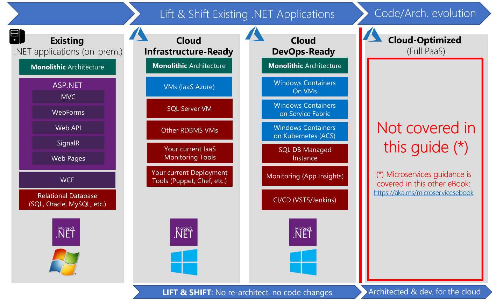

# What this guide does not cover

This guide covers a specific subset of the example scenarios, as shown in Figure 1-7. This guide focuses only on lift and shift scenarios, and ultimately, on the Cloud DevOps-Ready model. In the Cloud DevOps-Ready model, a .NET Framework application is modernized by using Windows Containers, plus additional components like monitoring and CI/CD pipelines. Each component is fundamental to deploying applications to the cloud, faster, and with agility.

> **Figure 1-7.** Lift and shift and initial modernization to Cloud DevOps-Ready applications

The focus of this guide is specific. We show you the path you can take to achieve a lift and shift of your existing .NET applications, without re-architecting, and with no code changes. Ultimately, we show you how to make your application Cloud DevOps-Ready.

This guide doesn't show you how to work with cloud-native applications, such as how to evolve to a microservices architectures. To re-architect your applications or to create brand-new applications that are based on microservices, see the eBook [.NET Microservices: Architecture for containerized .NET applications](https://aka.ms/microservicesebook).

### Additional resources

-   **Containerized Docker application lifecycle with Microsoft platform and tools** (downloadable eBook): [*https://aka.ms/dockerlifecycleebook*](https://aka.ms/dockerlifecycleebook)

-   **.NET Microservices: Architecture for containerized .NET applications** (downloadable eBook): [*https://aka.ms/microservicesebook*](https://aka.ms/microservicesebook)

-   **Architecting modern web applications with ASP.NET Core and Azure** (downloadable eBook): [*https://aka.ms/webappebook*](https://aka.ms/webappebook)

> [Previous](path-to-the-cloud-for-existing-.net-applications.md)  
[Next](who-should-use-this-guide.md)
