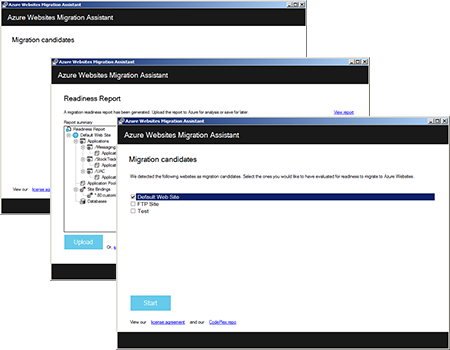

# How to deploy existing .NET apps to Azure App Service 

The Web Apps feature of Azure App Service is a fully managed compute platform that is optimized for hosting websites and web apps. This PaaS offering in Microsoft Azure lets you focus on your business logic, while Azure takes care of the infrastructure to run and scale your apps.

## Validate sites and migrate to App Service with Azure App Service Migration Assistant

When you create a new application in Visual Studio, moving the app to App Service usually is straightforward. However, if you are planning to migrate an existing application to App Service, first you need to evaluate whether all your application's dependencies are compatible with App Service. This includes dependencies like server OS and any third-party software that's installed on the server.

You can use [Azure App Service Migration Assistant](https://www.migratetoazure.net/) to analyze sites and then migrate them from Windows and Linux web servers to App Service. As part of the migration, the tool creates web apps and databases on Azure as needed, publishes content, and publishes your database.

Azure App Service Migration Assistant supports migrating from IIS running on Windows Server to the cloud. App Service supports Windows Server 2003 and later versions.

> 
>
> **Figure 4-5.** Using Azure App Service Migration Assistant

App Service Migration Assistant is a tool that moves your websites from your web servers to the Azure cloud.

After a website is migrated to App Service, the site has everything it needs to run safely and efficiently. Sites are set up and run automatically in the Azure cloud PaaS service (App Service).

The App Service migration tool can analyze your websites and report on their compatibility for moving to App Service. If you're happy with the analysis, you can let App Service Migration Assistant migrate content, data, and settings for you. If a site is not quite compatible, the migration tool tells you what you need to adjust to make it work.

### Additional resources

- **Azure App Service Migration Assistant**

    [https://www.migratetoazure.net/](https://www.migratetoazure.net/)

>[!div class="step-by-step"]
[Previous](what-about-cloud-optimized-applications.md)
[Next](deploy-existing-net-apps-as-windows-containers.md)
