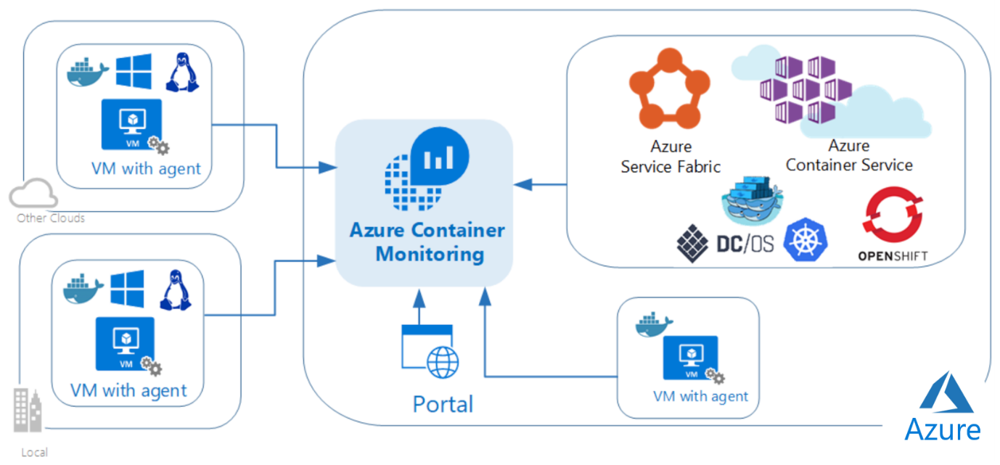

# Modernize your apps with monitoring and telemetry

When you run an application in production, it's critical that you have insights about how your application is performing. Is it performing at a high level? Are users getting errors, or is the application stable and reliable? You need rich performance monitoring, powerful alerting, and dashboards to help ensure that your application is available and performing as expected. You also need to be able to see quickly if there's a problem, determine how many customers are affected, and perform a root-cause analysis to find and fix the issue.

## Monitor your application with Application Insights

Application Insights is an extensible Application Performance Management (APM) service for web developers who work on multiple platforms. Use it to monitor your live web application. Application Insights automatically detects performance anomalies. It includes powerful analytics tools to help you diagnose issues, and to help you understand what users actually do with your app. Application Insights is designed to help you continuously improve performance and usability. It works for apps on a wide variety of platforms, including .NET, Node.js, and J2EE, whether hosted on-premises or in the cloud. Application Insights integrates with your DevOps processes, and has connection points to a variety of development tools.

Figure 4-10 shows an example of how Application Insights monitors your application and how it surfaces those insights to a dashboard.

> **Figure 4-10.** Application Insights monitoring dashboard

## Monitor your Docker infrastructure with Log Analytics and its Container Monitoring solution

[Azure Log Analytics](https://docs.microsoft.com/azure/log-analytics/log-analytics-overview) is part of the [Microsoft Azure overall monitoring solution](https://docs.microsoft.com/azure/monitoring-and-diagnostics/monitoring-overview). It's also a service in [Operations Management Suite (OMS)](https://docs.microsoft.com/azure/operations-management-suite/operations-management-suite-overview). Log Analytics monitors cloud and on-premises environments (OMS for on-premises) to help maintain availability and performance. It collects data generated by resources in your cloud and on-premises environments and from other monitoring tools to provide analysis across multiple sources.

In relation to Azure infrastructure logs, Log Analytics, as an Azure service, ingests log and metric data from other Azure services (via [Azure Monitor](https://docs.microsoft.com/azure/monitoring-and-diagnostics/monitoring-overview-azure-monitor)), Azure VMs, Docker containers, and on-premises or other cloud infrastructures. Log Analytics offers flexible log search and out-of-the box analytics on top of this data. It provides rich tools that you can use to analyze data across sources, it allows complex queries across all logs, and it can proactively alert based on specified conditions. You can even collect custom data in the central Log Analytics repository, where you can query and visualize it. You also can take advantage of the Log Analytics built-in solutions to immediately gain insights into the security and functionality of your infrastructure.

You can access Log Analytics through the OMS portal or the Azure portal, which run in any browser, and provide you with access to configuration settings and multiple tools to analyze and act on collected data.

The [Container Monitoring solution](https://docs.microsoft.com/azure/log-analytics/log-analytics-containers) in Log Analytics helps you view and manage your Docker and Windows Container hosts in a single location. The solution shows which containers are running, what container image they're running, and where containers are running. You can view detailed audit information, including commands that are being used with containers. You also can troubleshoot containers by viewing and searching centralized logs, without needing to remotely view Docker or Windows hosts. You can find containers that might be noisy and consuming excess resources on a host. Additionally, you can view centralized CPU, memory, storage, and network usage, and performance information, for containers. On computers running Windows, you can centralize and compare logs from Windows Server, Hyper-V, and Docker containers. The solution supports the following container orchestrators:

-   Docker Swarm

-   DC/OS

-   Kubernetes

-   Service Fabric

-   Red Hat OpenShift

Figure 4-11 shows the relationships between various container hosts and agents and OMS.

> **Figure 4-11.** Log Analytics Container Monitoring solution

You can use the Log Analytics Container Monitoring solution to:

-   See information about all container hosts in a single location.

-   Know which containers are running, what image they're running, and where they're running.

-   See an audit trail for actions on containers.

-   Troubleshoot by viewing and searching centralized logs without remote login to the Docker hosts.

-   Find containers that might be "noisy neighbors," and be consuming excess resources on a host.

-   View centralized CPU, memory, storage, and network usage, and performance information, for containers.

### Additional resources

-   **Overview of monitoring in Microsoft Azure**

[https://docs.microsoft.com/azure/monitoring-and-diagnostics/monitoring-overview](https://docs.microsoft.com/azure/monitoring-and-diagnostics/monitoring-overview)

-   **What is Application Insights?**

[https://docs.microsoft.com/azure/application-insights/app-insights-overview](https://docs.microsoft.com/azure/application-insights/app-insights-overview)

-   **What is Log Analytics?**

[https://docs.microsoft.com/azure/log-analytics/log-analytics-overview](https://docs.microsoft.com/azure/log-analytics/log-analytics-overview)

-   **Container Monitoring solution in Log Analytics**

[https://docs.microsoft.com/azure/log-analytics/log-analytics-containers](https://docs.microsoft.com/azure/log-analytics/log-analytics-containers)

-   **Overview of Azure Monitor**

[https://docs.microsoft.com/azure/monitoring-and-diagnostics/monitoring-overview-azure-monitor](https://docs.microsoft.com/azure/monitoring-and-diagnostics/monitoring-overview-azure-monitor)

-   **What is Operations Management Suite (OMS)?**

[https://docs.microsoft.com/azure/operations-management-suite/operations-management-suite-overview](https://docs.microsoft.com/azure/operations-management-suite/operations-management-suite-overview)

-   **Monitoring Windows Server containers in Service Fabric with OMS**

[https://docs.microsoft.com/azure/service-fabric/service-fabric-diagnostics-containers-windowsserver](https://docs.microsoft.com/azure/service-fabric/service-fabric-diagnostics-containers-windowsserver)

>[!div class="step-by-step"]
[Previous](build-resilient-services-ready-for-the-cloud-embrace-transient-failures-in-the-cloud.md)
[Next](modernize-your-apps-lifecycle-with-ci-cd-pipelines-and-devops-tools-in-the-cloud.md)
