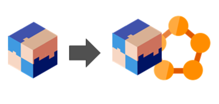

# When to deploy Windows Containers to Service Fabric

Applications that are based on Windows Containers will quickly need to use platforms that move even further away from IaaS VMs. This is for improved automated scalability and high scalability, and to gain significant improvements in a complete management experience for deployments, upgrades, versioning, rollbacks, and health monitoring. You can achieve these goals with the orchestrator Azure Service Fabric, available in the Microsoft Azure cloud, but also on-premises, or even in another cloud.

Many organizations are lifting and shifting existing monolithic applications to containers for two reasons:

-   Cost reductions, either due to consolidation and removal of existing hardware, or from running applications at a higher density.

-   A consistent deployment contract between development and operations.

Pursuing cost reductions is understandable, and it's likely that all organizations are chasing that goal. Consistent deployment is harder to evaluate, but it's equally as important. A consistent deployment contract says that developers are free to choose to use the technology that suits them, and the operations team gets a single way to deploy and manage applications. This agreement alleviates the pain of having operations deal with the complexity of many different technologies, or forcing developers to work only with certain technologies. Essentially, each application is containerized in a self-contained deployment image.

Some organizations will continue modernizing by adding microservices (Cloud-Optimized and cloud-native applications). Many organizations will stop here (Cloud DevOps-Ready). As shown in Figure 4-8, these organizations won't move to microservices architectures because they might not need to. In any case, they already get the benefits that using containers plus Service Fabric provides-a complete management experience that includes deployment, upgrades, versioning, rollbacks, and health monitoring.

> 
>
> **Figure 4-8.** Lift and shift an application to Service Fabric

A key approach to Service Fabric is to reuse existing code and simply lift and shift. Therefore, you can migrate your current .NET Framework applications, by using Windows Containers, and deploy them to Service Fabric. It will be easier to keep going modernizing, eventually, by adding new microservices.

When comparing Service Fabric to other orchestrators, it's important to highlight that Service Fabric is very mature at running Windows-based applications and services. Service Fabric has been running Windows-based services and applications, including Tier-1, mission-critical products from Microsoft, for years. It was the first orchestrator to have general availability for Windows Containers (May 2017). Other containers, like Kubernetes, DC/OS, and Docker Swarm, are more mature in Linux, but less mature than Service Fabric for Windows-based applications and Windows Containers.

The ultimate goal of Service Fabric is to reduce the complexities of building applications by using a microservices approach. This is where you eventually want to be for certain types of applications, to avoid costly redesigns. You can start small, scale when needed, deprecate services, add new services, and evolve your application with customer use. We know that there are many other problems that are yet to be solved to make microservices more approachable for most developers. If you currently are just lifting and shifting an application with Windows Containers, but you are thinking about adding microservices based on containers in the future, that is the Service Fabric sweet spot.

> [Previous](when-to-deploy-windows-containers-to-azure-vms-iaas-cloud.md)  
[Next](when-to-deploy-windows-containers-to-azure-container-service-kubernetes.md)
