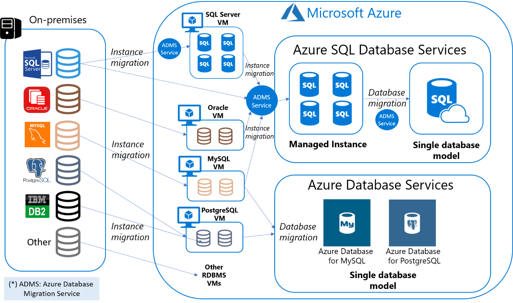

-   [When to migrate to Azure SQL Database Managed Instance](#when-to-migrate-to-azure-sql-database-managed-instance)
-   [When to migrate to Azure SQL Database ](#when-to-migrate-to-azure-sql-database)
-   [When to move your original RDBMS to a VM (IaaS)](#when-to-move-your-original-rdbms-to-a-vm-iaas)
-   [When to migrate to SQL Server as a VM (IaaS)](#when-to-migrate-to-sql-server-as-a-vm-iaas)
-   [Use Azure Database Migration Service to migrate your relational databases to Azure ](#use-azure-database-migration-service-to-migrate-your-relational-databases-to-azure)
    -   [Additional resources](#additional-resources)

Vision: Azure offers the most comprehensive database migration.

In Azure, you can migrate your database servers directly to IaaS VMs (pure lift and shift), or you can migrate to Azure SQL Database, for additional benefits. Azure SQL Database offers managed instance and full database-as-a-service (DBaaS) options. Figure 3-1 shows the multiple relational database migration paths available in Azure.

> **Figure 3-1.** Database migration paths in Azure

> [Previous](../lift-and-shift-existing-apps-azure-iaas/use-azure-site-recovery-to-migrate-your-existing-vms-to-azure-vms.md)  
[Next](when-to-migrate-to-azure-sql-database-managed-instance.md)
