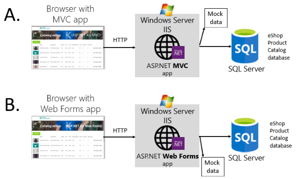

# Walkthrough 1: Tour of eShop legacy apps

## Technical walkthrough availability

The full technical walkthrough is available in the eShopModernizing GitHub repo wiki:

<https://github.com/dotnet-architecture/eShopModernizing/wiki/01.-Tour-on-eShopModernizing-apps-implementation-code>

## Overview

In this walkthrough, you can explore the initial implementation of two sample legacy applications. Both sample apps have a monolithic architecture, and were created by using classic ASP.NET. One application is based on ASP.NET 4.x MVC; the second application is based on ASP.NET 4.x Web Forms. Both applications are in the [eShopModernizing GitHub repo](https://github.com/dotnet-architecture/eShopModernizing).

You can containerize both sample apps, similar to the way you can containerize a classic [Windows Communication Foundation](https://docs.microsoft.com/en-us/dotnet/framework/wcf/whats-wcf) (WCF) application to be consumed as a desktop application. For an example, see [eShopModernizingWCFWinForms](https://github.com/dotnet-architecture/eShopModernizingWCFWinForms).

## Goals

The main goal of this walkthrough is simply to get familiar with these apps, and with their code and configuration. You can configure the apps so that they generate and use mock data, without using the SQL database, for testing purposes. This optional config is based on dependency injection, in a decoupled way.

## Scenario

Figure 5-1 shows the simple scenario of the original legacy applications.

> 
>
> **Figure 5-1.** Simple architecture scenario of the original legacy applications

From a business domain perspective, both apps offer the same catalog management features. Members of the eShop enterprise team would use the app to view and edit the product catalog. Figure 5-2 shows the initial app screenshots.

> **Figure 5-2.** ASP.NET MVC and ASP.NET Web Forms applications (existing/legacy technologies)

These are web applications that are used to browse and modify catalog entries. The fact that both apps deliver the same business/functional features is simply for comparison purposes. You can see a similar modernization process for apps that were created by using the ASP.NET MVC and ASP.NET Web Forms frameworks.

Dependencies in ASP.NET 4.x or earlier versions (either for MVC or for Web Forms) means that these applications won't run on .NET Core unless the code is fully rewritten by using ASP.NET Core MVC. This demonstrates the point that if you don't want to re-architect or rewrite code, you can containerize existing applications, and still use the same .NET technologies and the same code. You can see how you can run applications like these in containers, without any changes to legacy code.

## Benefits

The benefits of this walkthrough are simple: Just get familiar with the code and application configuration, based on dependency injection. Then, you can experiment with this approach when you containerize and deploy to multiple environments in the future.

## Next steps

Explore this content more in-depth on the GitHub wiki:

<https://github.com/dotnet-architecture/eShopModernizing/wiki/01.-Tour-on-eShopModernizing-apps-implementation-code>

> [Previous](technical-walkthrough-list.md)  
[Next](walkthrough-2-containerize-your-existing-.net-applications-with-windows-containers.md)
