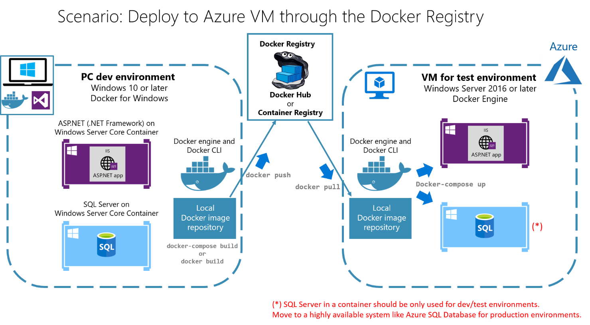
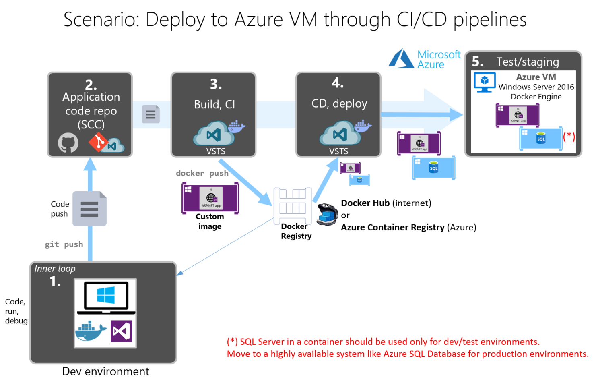

# Walkthrough 3: Deploy your Windows Containers-based app to Azure VMs

## Technical walkthrough availability

The full technical walkthrough is available in the eShopModernizing GitHub repo wiki:

<https://github.com/dotnet-architecture/eShopModernizing/wiki/03.-How-to-deploy-your-Windows-Containers-based-app-into-Azure-VMs-(Including-CI-CD)>

## Overview

Deploying to a Docker host on a Windows Server 2016 VM in Azure lets you quickly set up dev/test/staging environments. It also gives you a common place for testers or business users to validate the app. VMs also can be valid IaaS production environments.

## Goals

The goal of this walkthrough is to show you the multiple alternatives you have when you deploy Windows Containers to Azure VMs that are based on Windows Server 2016 or later versions.

## Scenarios

Several scenarios are covered in this walkthrough.

### Scenario A: Deploy to an Azure VM from a dev PC through Docker Engine connection

> **Figure 5-4.** Deploy to an Azure VM from a dev PC through a Docker Engine connection

### Scenario B: Deploy to an Azure VM through a Docker Registry

> **Figure 5-5.** Deploy to an Azure VM through a Docker Registry

### Scenario C: Deploy to an Azure VM from CI/CD pipelines in Visual Studio Team Services

> **Figure 5-6.** Deploy to an Azure VM from CI/CD pipelines in Visual Studio Team Services

## Azure VMs for Windows Containers

Azure VMs for Windows Containers are simply VMs that are based on Windows Server 2016, Windows 10, or later versions, both with Docker Engine set up. In most cases, you will use Windows Server 2016 in the Azure VMs.

Azure currently provides a VM named **Windows Server 2016 with Containers**. You can use this VM to try the new Windows Server Container feature, with either Windows Server Core or Windows Nano Server. Container OS images are installed, and then the VM is ready to use with Docker.

## Benefits

Although Windows Containers can be deployed to on-premises Windows Server 2016 VMs, when you deploy to Azure, you get an easier way to get started, with ready-to-use Windows Server Container VMs. You also get a common online location that’s accessible to testers, and automatic scalability through Azure VM scale sets.

## Next steps

Explore this content more in-depth on the GitHub wiki:

<https://github.com/dotnet-architecture/eShopModernizing/wiki/03.-How-to-deploy-your-Windows-Containers-based-app-into-Azure-VMs-(Including-CI-CD)>

> [Previous](walkthrough-2-containerize-your-existing-.net-applications-with-windows-containers.md)  
[Next](walkthrough-4-deploy-your-windows-containers-based-apps-to-kubernetes-in-azure-container-service.md)
