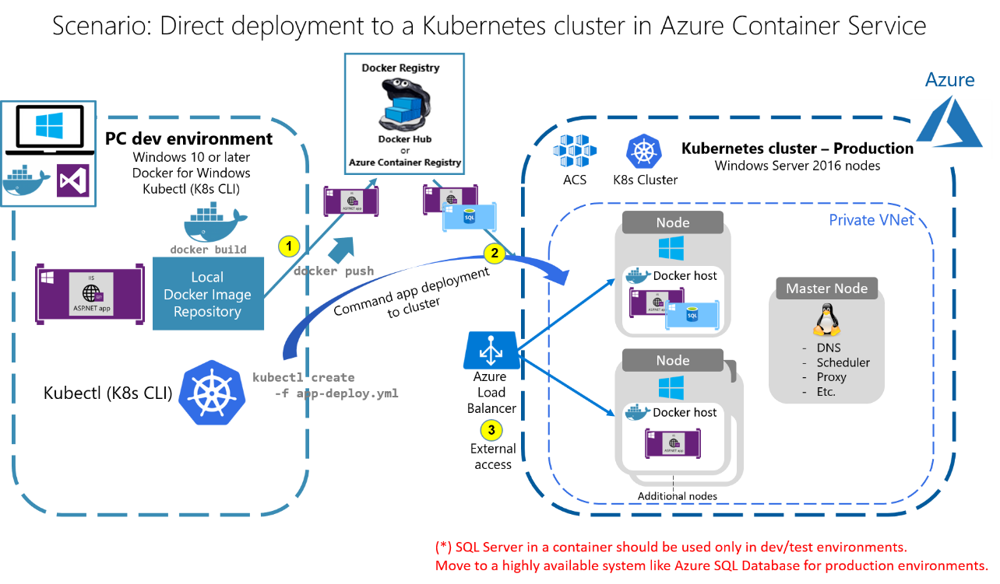
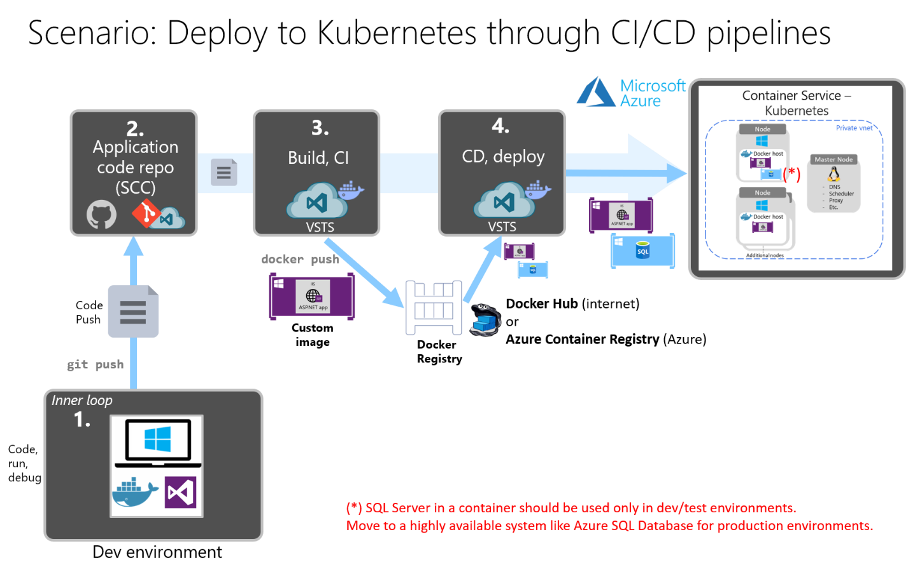

# Walkthrough 4: Deploy your Windows Containers-based apps to Kubernetes in Azure Container Service

## Technical walkthrough availability

The full technical walkthrough is available in the eShopModernizing GitHub repo wiki:

<https://github.com/dotnet-architecture/eShopModernizing/wiki/04.-How-to-deploy-your-Windows-Containers-based-apps-into-Kubernetes-in-Azure-Container-Service-(Including-C-CD)>

## Overview

An application that's based on Windows Containers will quickly need to use platforms, moving even further away from IaaS VMs. This is needed to easily achieve high scalability and better automated scalability, and for a significant improvement in automated deployments and versioning. You can achieve these goals by using the orchestrator [Kubernetes](https://kubernetes.io/), available in [Azure Container Services](https://azure.microsoft.com/en-us/services/container-service/).

## Goals

The goal of this walkthrough is to learn how to deploy a Windows Container–based application to Kubernetes (also called *K8s*) in Azure Container Service. Deploying to Kubernetes from scratch is a two-step process:

1.  Deploy a Kubernetes cluster to Azure Container Service.

2.  Deploy the application and related resources to the Kubernetes cluster.

## Scenarios

### Scenario A: Deploy directly to a Kubernetes cluster from a dev environment

> **Figure 5-7.** Deploy directly to a Kubernetes cluster from a development environment

### Scenario B: Deploy to a Kubernetes cluster from CI/CD pipelines in Team Services

> **Figure 5-8.** Deploy to a Kubernetes cluster from CI/CD pipelines in Team Services

## Benefits

There are many benefits to deploying to a cluster in Kubernetes. The biggest benefit is that you get a production-ready environment in which you can scale-out the application based on the number of container instances you want to use (inner-scalability in the existing nodes), and based on the number of nodes or VMs in the cluster (global scalability of the cluster).

Azure Container Service optimizes popular open-source tools and technologies specifically for Azure. You get an open solution that offers portability, both for your containers and for your application configuration. You select the size, the number of hosts, and the orchestrator tools-Container Service handles everything else.

With Kubernetes, developers can progress from thinking about physical and virtual machines, to planning a container-centric infrastructure that facilitates the following capabilities, among others:

-   Applications based on multiple containers

-   Replicating container instances and horizontal autoscaling

-   Naming and discovering (for example, internal DNS)

-   Balancing loads

-   Rolling updates

-   Distributing secrets

-   Application health checks

## Next steps

Explore this content more in-depth on the GitHub wiki: <https://github.com/dotnet-architecture/eShopModernizing/wiki/04.-How-to-deploy-your-Windows-Containers-based-apps-into-Kubernetes-in-Azure-Container-Service-(Including-C-CD)>

> [Previous](walkthrough-3-deploy-your-windows-containers-based-app-to-azure-vms.md)  
[Next](walkthrough-5-deploy-your-windows-containers-based-apps-to-azure-service-fabric.md)
