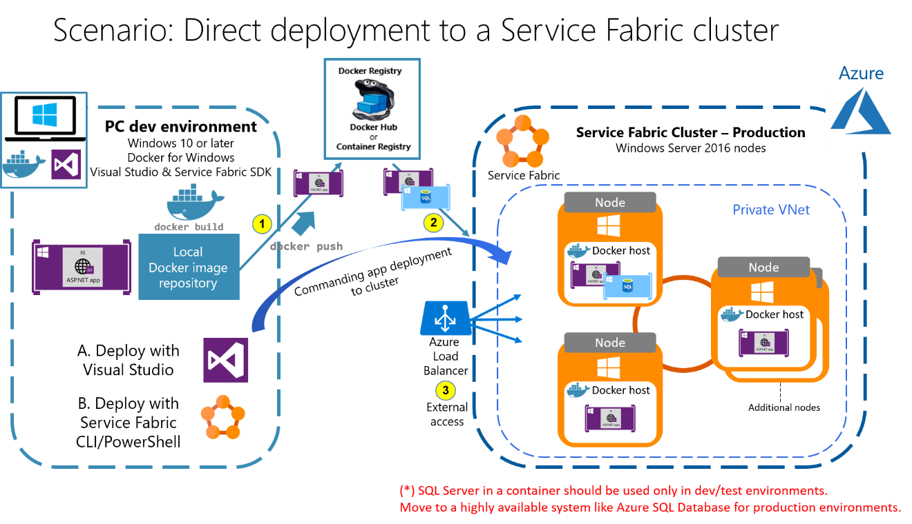
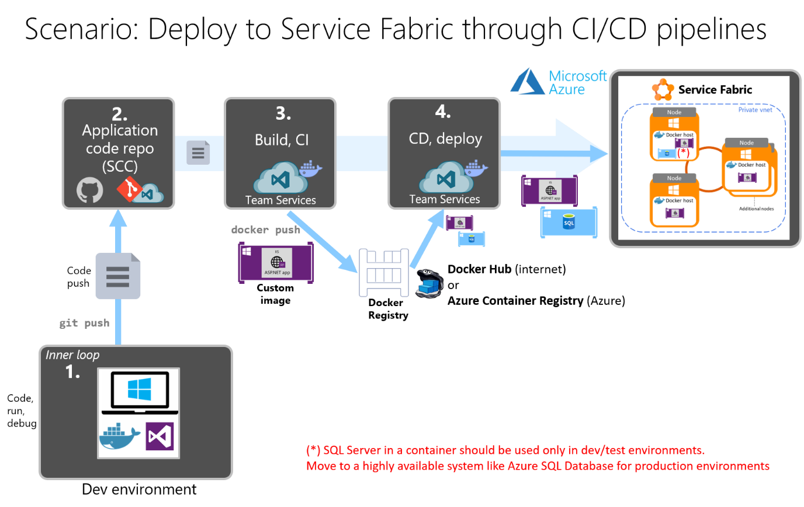

# Walkthrough 5: Deploy your Windows Containers-based apps to Azure Service Fabric

## Technical walkthrough availability

The full technical walkthrough is available in the eShopModernizing GitHub repo wiki:

<https://github.com/dotnet-architecture/eShopModernizing/wiki/05.-How-to-deploy-your-Windows-Containers-based-apps-into-Azure-Service-Fabric-(Including-CI-CD)>

## Overview

An application that's based on Windows Containers will quickly need to use platforms, moving even further away from IaaS VMs. This is needed to easily achieve high scalability and better automated scalability, and for a significant improvement in automated deployments and versioning. You can achieve these goals by using the orchestrator Azure Service Fabric, which is available in the Azure cloud, but also available to use on-premises, or even in a different public cloud.

## Goals

The goal of this walkthrough is to learn how to deploy a Windows Container–based application to a Service Fabric cluster in Azure. Deploying to Service Fabric from scratch is a two-step process:

1.  Deploy a Service Fabric cluster to Azure (or to a different environment).

2.  Deploy the application and related resources to the Service Fabric cluster.

## Scenarios

### Scenario A: Deploy directly to a Service Fabric cluster from a dev environment

> **Figure 5-9.** Deploy directly to a Service Fabric cluster from a development environment

### Scenario B: Deploy to a Service Fabric cluster from CI/CD pipelines in Team Services

> **Figure 5-10.** Deploy to a Service Fabric cluster from CI/CD pipelines in Visual Studio Team Services

## Benefits

The benefits of deploying to a cluster in Service Fabric are similar to the benefits of using Kubernetes. One difference, though, is that Service Fabric is a very mature production environment for Windows applications compared to Kubernetes, which was in preview for Windows Containers until early fall of 2017. (Kubernetes is a more mature environment for Linux). 

The main benefit of using Azure Service Fabric is that you get a production-ready environment in which you can scale-out the application based on the number of container instances you want to use (inner-scalability in the existing nodes), and based on the number of nodes or VMs in the cluster (global scalability of the cluster).

Azure Service Fabric offers portability both for your containers and for your application configuration. You can have a Service Fabric cluster in Azure, or install it on-premises in your own datacenter. You can even install a Service Fabric cluster in a different cloud, like [Amazon AWS](https://blogs.msdn.microsoft.com/azureservicefabric/2017/05/18/tutorial-how-to-create-a-service-fabric-standalone-cluster-with-aws-ec2-instances/).

With Service Fabric, developers can progress from thinking about physical and virtual machines to planning a container-centric infrastructure that facilitates the following capabilities, among others:

-   Applications based on multiple containers.

-   Replicating container instances and horizontal autoscaling.

-   Naming and discovering (for example, internal DNS).

-   Balancing loads.

-   Rolling updates.

-   Distributing secrets.

-   Application health checks.

The following capabilities are exclusive in Service Fabric (compared to other orchestrators):

-   Stateful services capability, through the Reliable Services application model.

-   Actors pattern, through the Reliable Actors application model.

-   Deploy bare-bone processes, in addition to Windows or Linux containers.

-   Advanced rolling updates and health checks.

## Next steps

Explore this content more in-depth on the GitHub wiki:

<https://github.com/dotnet-architecture/eShopModernizing/wiki/05.-How-to-deploy-your-Windows-Containers-based-apps-into-Azure-Service-Fabric-(Including-CI-CD)>

> [Previous](walkthrough-4-deploy-your-windows-containers-based-apps-to-kubernetes-in-azure-container-service.md)  
[Next](../conclusions/index.md)
