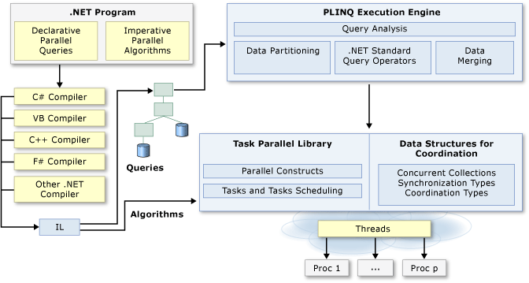

# Parallel Programming in .NET
Many personal computers and workstations have two or four cores (that is, CPUs) that enable multiple threads to be executed simultaneously. Computers in the near future are expected to have significantly more cores. To take advantage of the hardware of today and tomorrow, you can parallelize your code to distribute work across multiple processors. In the past, parallelization required low-level manipulation of threads and locks. [!INCLUDE[vs_dev10_long](../../../includes/vs-dev10-long-md.md)] and the [!INCLUDE[net_v40_short](../../../includes/net-v40-short-md.md)] enhance support for parallel programming by providing a new runtime, new class library types, and new diagnostic tools. These features simplify parallel development so that you can write efficient, fine-grained, and scalable parallel code in a natural idiom without having to work directly with threads or the thread pool. The following illustration provides a high-level overview of the parallel programming architecture in the [!INCLUDE[net_v40_short](../../../includes/net-v40-short-md.md)].  
  
   
  
## Related Topics  
  
|Technology|Description|  
|----------------|-----------------|  
|[Task Parallel Library (TPL)](../../../docs/standard/parallel-programming/task-parallel-library-tpl.md)|Provides documentation for the <xref:System.Threading.Tasks.Parallel?displayProperty=nameWithType> class, which includes parallel versions of `For` and `ForEach` loops, and also for the <xref:System.Threading.Tasks.Task?displayProperty=nameWithType> class, which represents the preferred way to express asynchronous operations.|  
|[Parallel LINQ (PLINQ)](../../../docs/standard/parallel-programming/parallel-linq-plinq.md)|A parallel implementation of LINQ to Objects that significantly improves performance in many scenarios.|  
|[Data Structures for Parallel Programming](../../../docs/standard/parallel-programming/data-structures-for-parallel-programming.md)|Provides links to documentation for thread-safe collection classes, lightweight synchronization types, and types for lazy initialization.|  
|[Parallel Diagnostic Tools](../../../docs/standard/parallel-programming/parallel-diagnostic-tools.md)|Provides links to documentation for Visual Studio debugger windows for tasks and parallel stacks, and the [Concurrency Visualizer](/visualstudio/profiling/concurrency-visualizer), which consists of a set of views in the [!INCLUDE[vsprvsts](../../../includes/vsprvsts-md.md)] Profiler that you can use to debug and to tune the performance of parallel code.|  
|[Custom Partitioners for PLINQ and TPL](../../../docs/standard/parallel-programming/custom-partitioners-for-plinq-and-tpl.md)|Describes how partitioners work and how to configure the default partitioners or create a new partitioner.|  
|[Task Schedulers](http://msdn.microsoft.com/library/638f8ea5-21db-47a2-a934-86e1e961bf65)|Describes how schedulers work and how the default schedulers may be configured.|  
|[Lambda Expressions in PLINQ and TPL](../../../docs/standard/parallel-programming/lambda-expressions-in-plinq-and-tpl.md)|Provides a brief overview of lambda expressions in C# and Visual Basic, and shows how they are used in PLINQ and the Task Parallel Library.|  
|[For Further Reading](../../../docs/standard/parallel-programming/for-further-reading-parallel-programming.md)|Provides links to additional documentation and sample resources for parallel programming in the .NET Framework.|  
  
## See Also  
 [Patterns for Parallel Programming: Understanding and Applying Parallel Patterns with the .NET Framework 4](http://go.microsoft.com/fwlink/?LinkID=185142)  
 [Samples for Parallel Programming with the .NET Framework](http://code.msdn.microsoft.com/Samples-for-Parallel-b4b76364)
