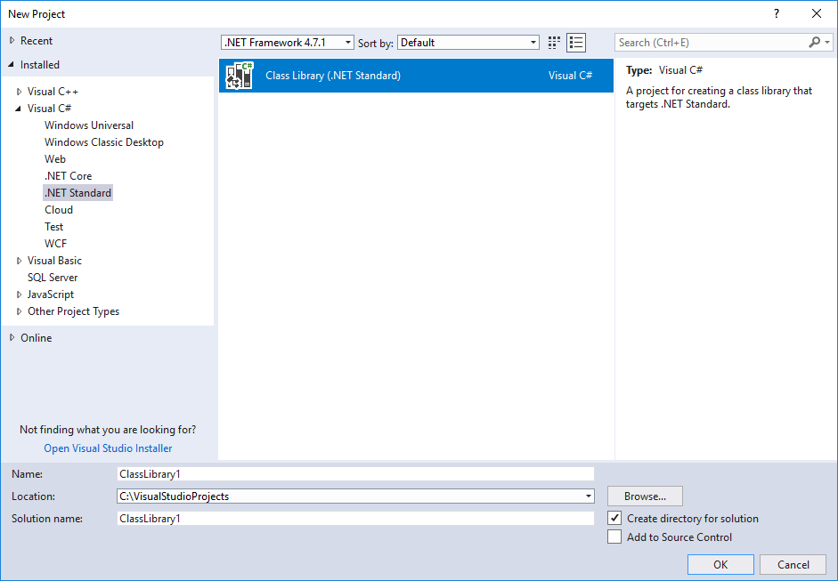
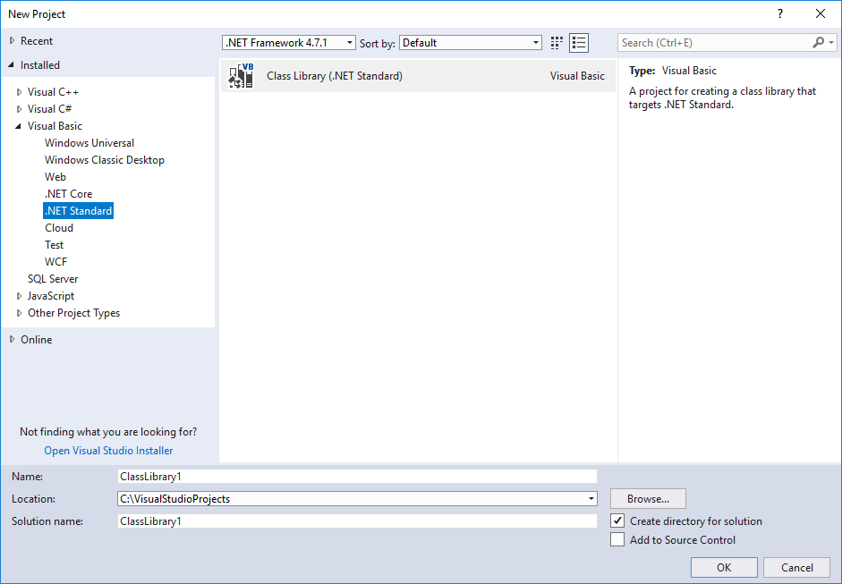

# What's new in the .NET Standard

The .NET Standard is a formal specification that defines a versioned set of APIs which must be available on .NET implementations that comply with that version of the standard. The .NET Standard is targeted at library developers. A library that targets a .NET Standard version can be used on any .NET Framework, .NET Core, or Xamarin implementation that supports that version of the standard.

The most recent version of the .NET Standard is 2.0. It is included with the .NET Core 2.0 SDK, as well as with Visual Studio 2017 Version 15.3 with the .NET Core workload installed.

## Supported .NET implementations

The .NET Standard 2.0 is supported by the following .NET implementations:

- .NET Core 2.0
- .NET Framework 4.6.1
- Mono 5.4
- Xamarin.iOS 10.14
- Xamarin.Mac 3.8
- Xamarin.Android 8.0
- Universal Windows Platform 10.0.16299

## What's new in the .NET Standard 2.0
 
The .NET Standard 2.0 includes the following new features:

**A vastly expanded set of APIs**

Through version 1.6, the .NET Standard included a comparatively small subset of APIs. Among those excluded were many APIs that were commonly used in the .NET Framework or Xamarin. This complicates development, since it requires that developers find suitable replacements for familiar APIs when they develop applications and libraries that target multiple .NET implementations. The .NET Standard 2.0 addresses this limitation by adding over 20,000 more APIs than were available in .NET Standard 1.6, the previous version of the standard. For a list of the APIs that have been added to the .NET Standard 2.0, see [.NET Standard 2.0 vs 1.6](https://raw.githubusercontent.com/dotnet/standard/master/docs/versions/netstandard2.0_diff.md). 

Some of the additions to the <xref:System> namespace in .NET Standard 2.0 include:

- Support for the <xref:System.AppDomain> class.
- Better support for working with arrays from additional members in the <xref:System.Array> class.
- Better support for working with attributes from additional members in the <xref:System.Attribute> class.
- Better calendar support and additional formatting options for <xref:System.DateTime> values.
- Additional <xref:System.Decimal> rounding functionality.
- Additional functionality in the <xref:System.Environment> class.
- Enhanced control over the garbage collector through the <xref:System.GC> class.
- Enhanced support for string comparison, enumeration, and normalization in the <xref:System.String> class.
- Support for daylight saving adjustments and transition times in the <xref:System.TimeZoneInfo.AdjustmentRule> and <xref:System.TimeZoneInfo.TransitionTime> classes.
- Significantly enhanced functionality in the <xref:System.Type> class.
- Better support for deserialization of exception objects by adding an exception constructor with <xref:System.Runtime.Serialization.SerializationInfo> and <xref:System.Runtime.Serialization.StreamingContext> parameters.

**Support for .NET Framework libraries**

The overwhelming majority of libraries target the .NET Framework rather than .NET Standard. However, most of the calls in those libraries are to APIs that are included in the .NET Standard 2.0. Starting with the .NET Standard 2.0, you can access .NET Framework libraries from a .NET Standard library by using a [compatibility shim](https://github.com/dotnet/standard/blob/master/docs/netstandard-20/README.md#assembly-unification). This compatibility layer is transparent to developers; you don't have to do anything to take advantage of .NET Framework libraries.

The single requirement is that the APIs called by the .NET Framework class library must be included in the .NET Standard 2.0.

**Support for Visual Basic**

You can now develop .NET Standard libraries in Visual Basic. For Visual Basic developers using Visual Studio 2017 Version 15.3 or later with the .NET Core workload installed, Visual Studio now includes a .NET Standard Class Library template. For Visual Basic developers who use other development tools and environments, you can use the [dotnet new](../../core/tools/dotnet-new.md) command to create a .NET Standard Library project. For more information, see the [Tooling support for .NET Standard libraries](#tooling).

<a name="tooling" />**Tooling support for .NET Standard libraries**

With the release of .NET Core 2.0 and .NET Standard 2.0, both Visual Studio 2017 and the [.NET Core Command Line Interface (CLI)](../../core/tools/index.md) include tooling support for creating .NET Standard libraries. 

If you install Visual Studio with the **.NET Core cross-platform development** workload, you can create a .NET Standard 2.0 library project by using a project template, as the following figure shows. 

# [C#](#tab/csharp)

# [Visual Basic](#tab/visual-basic)

---

If you are using the .NET Core CLI, the following [dotnet new](../../core/tools/dotnet-new.md) command creates a class library project that targets the .NET Standard 2.0.

```csharp
dotnet new classlib
```
```vb
dotnet new classlib -lang vb
```
  
## See Also
[.NET Standard](../net-standard.md)
[Introducing .NET Standard](https://blogs.msdn.microsoft.com/dotnet/2016/09/26/introducing-net-standard/)
