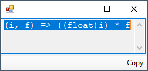
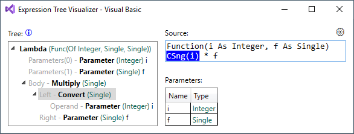

# Debugging Expression Trees in Visual Studio (Visual Basic)
You can analyze the structure and content of expression trees when you debug your applications. To get a quick overview of the expression tree structure, you can use the `DebugView` property, which represents expression trees using a special syntax described [below](#debugview-syntax). (Note that `DebugView` is available only in debug mode.)  


Since `DebugView` is a string, you can use the [built-in Text Visualizer](https://docs.microsoft.com/visualstudio/debugger/view-strings-visualizer#open-a-string-visualizer) to view it across multiple lines, by selecting **Text Visualizer** from the magnifying glass icon next to the `DebugView` label.

 

Alternatively, you can install and use [a custom visualizer](https://docs.microsoft.com/visualstudio/debugger/create-custom-visualizers-of-data) for expression trees:

* [Readable Expressions](https://github.com/agileobjects/ReadableExpressions), available on the [Visual Studio Marketplace](https://marketplace.visualstudio.com/items?itemName=vs-publisher-1232914.ReadableExpressionsVisualizers), which renders the expression tree as C# code:

  

* [Expression Tree Visualizer](https://github.com/zspitz/ExpressionToString#visual-studio-debugger-visualizer-for-expression-trees), which provides a graphical view of the expression tree, its properties, and related objects; and can render the expression tree using Visual Basic code:

  

### To open a visualizer for an expression tree  
  
1. Click the magnifying glass icon that appears next to the expression tree in **DataTips**, a **Watch** window, the **Autos** window, or the **Locals** window.  
  
     A list of available visualizers is displayed.: 

      

2. Click the visualizer you want to use.  

## `DebugView` syntax 

Each expression type is displayed in the visualizer as described in the following sections.

## ParameterExpressions

<xref:System.Linq.Expressions.ParameterExpression> variable names are displayed with a "$" symbol at the beginning.

If a parameter does not have a name, it is assigned an automatically generated name, such as `$var1` or `$var2`.

### Examples

- `Expression`

    ```vb
    Dim numParam As ParameterExpression =
    Expression.Parameter(GetType(Integer), "num")
    ```

    `DebugView` property

    `$num`

- `Expression`

    ```vb
    Dim numParam As ParameterExpression =
    Expression.Parameter(GetType(Integer))
    ```

    `DebugView` property

    `$var1`

## ConstantExpressions
 For <xref:System.Linq.Expressions.ConstantExpression> objects that represent integer values, strings, and `null`, the value of the constant is displayed.

### Examples

- `Expression`

    ```vb
    Dim num as Integer= 10
    Dim expr As ConstantExpression = Expression.Constant(num)
    ```

    `DebugView` property

    10

- `Expression`

    ```vb
    Dim num As Double = 10
    Dim expr As ConstantExpression = Expression.Constant(num)
    ```

    `DebugView` property

    10D

## BlockExpression

If the type of a <xref:System.Linq.Expressions.BlockExpression> object differs from the type of the last expression in the block, the type is displayed in the `DebugInfo` property in angle brackets (\< and >). Otherwise, the type of the <xref:System.Linq.Expressions.BlockExpression> object is not displayed.

### Examples

- `Expression`

    ```vb
    Dim block As BlockExpression = Expression.Block(Expression.Constant("test"))
    ```

    `DebugView` property

    `.Block() {`

    `"test"`

    `}`

- `Expression`

    ```vb
    Dim block As BlockExpression =
    Expression.Block(GetType(Object), Expression.Constant("test"))
    ```

    `DebugView` property

    `.Block<System.Object>() {`

    `"test"`

    `}`

## LambdaExpression

<xref:System.Linq.Expressions.LambdaExpression> objects are displayed together with their delegate types.

If a lambda expression does not have a name, it is assigned an automatically generated name, such as `#Lambda1` or `#Lambda2`.

### Examples

- `Expression`

    ```vb
    Dim lambda As LambdaExpression =
    Expression.Lambda(Of Func(Of Integer))(Expression.Constant(1))
    ```

    `DebugView` property

    `.Lambda #Lambda1<System.Func'1[System.Int32]>() {`

    `1`

    `}`

- `Expression`

    ```vb
    Dim lambda As LambdaExpression =
    Expression.Lambda(Of Func(Of Integer))(Expression.Constant(1), "SampleLambda", Nothing)
    ```

    `DebugView` property

    `.Lambda SampleLambda<System.Func'1[System.Int32]>() {`

    `1`

    `}`

## LabelExpression

If you specify a default value for the <xref:System.Linq.Expressions.LabelExpression> object, this value is displayed before the <xref:System.Linq.Expressions.LabelTarget> object.

The `.Label` token indicates the start of the label. The `.LabelTarget` token indicates the destination of the target to jump to.

If a label does not have a name, it is assigned an automatically generated name, such as `#Label1` or `#Label2`.

### Examples

- `Expression`

    ```vb
    Dim target As LabelTarget = Expression.Label(GetType(Integer), "SampleLabel")
    Dim label1 As BlockExpression = Expression.Block(
    Expression.Goto(target, Expression.Constant(0)),
    Expression.Label(target, Expression.Constant(-1)))
    ```

    `DebugView` property

    `.Block() {`

    `.Goto SampleLabel { 0 };`

    `.Label`

    `-1`

    `.LabelTarget SampleLabel:`

    `}`

- `Expression`

    ```vb
    Dim target As LabelTarget = Expression.Label()
    Dim block As BlockExpression = Expression.Block(
    Expression.Goto(target), Expression.Label(target))
    ```

    `DebugView` property

    `.Block() {`

    `.Goto #Label1 { };`

    `.Label`

    `.LabelTarget #Label1:`

    `}`

## Checked Operators

Checked operators are displayed with the "#" symbol in front of the operator. For example, the checked addition operator is displayed as `#+`.

### Examples

- `Expression`

    ```vb
    Dim expr As Expression = Expression.AddChecked(
    Expression.Constant(1), Expression.Constant(2))
    ```

    `DebugView` property

    `1 #+ 2`

- `Expression`

    ```vb
    Dim expr As Expression = Expression.ConvertChecked(
    Expression.Constant(10.0), GetType(Integer))
    ```

    `DebugView` property

    `#(System.Int32)10D`

## See also

- [Expression Trees (Visual Basic)](../../../../visual-basic/programming-guide/concepts/expression-trees/index.md)
- [Debugging in Visual Studio](/visualstudio/debugger/debugging-in-visual-studio)
- [Create Custom Visualizers](/visualstudio/debugger/create-custom-visualizers-of-data)
